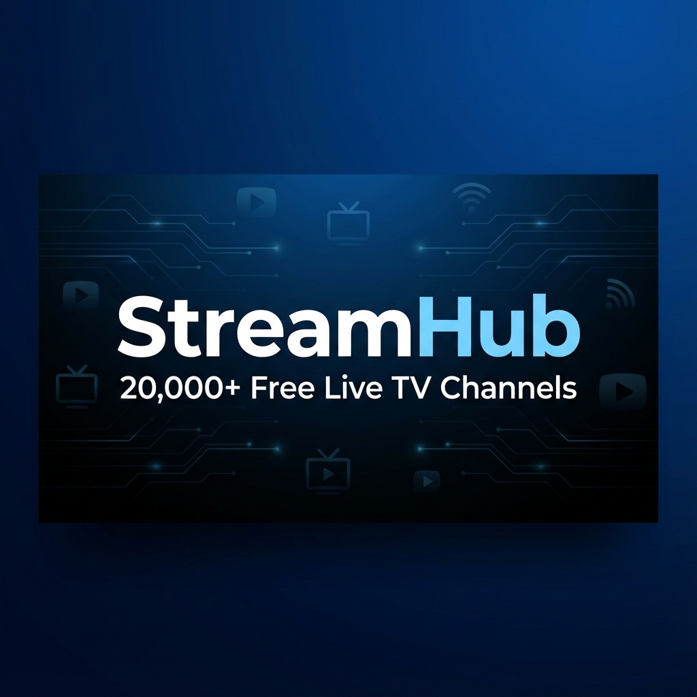

# StreamHub 📺

A modern live TV streaming directory with **20,000+ channels** from **180+ countries**. Built with Next.js 16 and featuring a sleek, Apple TV-inspired interface.



## ✨ Features

### 🌍 Global Channel Directory
- **20,000+ Live Channels** from around the world
- **180+ Countries** supported
- **29 Categories** including News, Sports, Entertainment, Movies, and more

### 🇮🇳 India Mode
StreamHub has a dedicated **India Mode** that prioritizes:
- Popular Indian news channels (Aaj Tak, NDTV, Republic, Zee News, India Today)
- Malayalam channels (Asianet, Manorama News, Flowers, Surya TV)
- Hindi entertainment (Star Plus, Zee TV, Colors, Sony)
- Regional content in Tamil, Telugu, Kannada, Bengali, and more

### 📰 News Channels
Access live news from top broadcasters:
- **Indian News**: Aaj Tak, NDTV, Republic TV, Times Now, India Today, News18
- **Malayalam News**: Manorama News, Asianet News, Media One, Reporter TV, 24 News
- **International**: BBC, CNN, Al Jazeera, France 24, DW

### ⚽ Sports Channels
Never miss a match with live sports coverage:
- Star Sports (1, 2, 3)
- Sony Sports, Sony Ten
- DD Sports
- Eurosport
- Sports18

### 🎬 Movie Channels
Bollywood and regional cinema at your fingertips:
- **Hindi Movies**: Star Gold, Zee Cinema, Sony MAX, Colors Cineplex
- **Malayalam Movies**: Asianet Movies, Surya Movies
- **South Indian**: Star Maa Movies, Gemini Movies, Sun TV Movies
- **Regional**: Zee Picchar, Colors Kannada Cinema

### 🎭 Entertainment Channels
Top entertainment networks:
- Star Plus, Star Bharat
- Zee TV, Zee Kannada, Zee Tamil
- Colors, Colors Tamil
- Sony, SAB TV
- Asianet, Mazhavil Manorama, Flowers

### 🔍 Smart Search
- Real-time search with suggestions
- Filter by country, category, or language
- Quick access to favorite channels

### ❤️ Favorites
- Save your favorite channels
- Quick access from any page
- Persistent across sessions

## 🛠️ Tech Stack

- **Framework**: Next.js 16 (App Router)
- **Language**: TypeScript
- **Styling**: Tailwind CSS
- **UI Components**: shadcn/ui
- **State Management**: React Context + Zustand
- **Analytics**: Vercel Analytics

## 🚀 Getting Started

### Prerequisites
- Node.js 18+
- pnpm (recommended)

### Installation

```bash
# Clone the repository
git clone https://github.com/arshadakl/streamhub.git

# Navigate to project
cd streamhub

# Install dependencies
pnpm install

# Run development server
pnpm dev
```

Open [http://localhost:3000](http://localhost:3000) to view the app.

## 📁 Project Structure

```
streamhub/
├── app/
│   ├── _components/      # Page-specific components
│   ├── _constants/       # Constants and configurations
│   ├── _hooks/           # Custom React hooks
│   ├── _utils/           # Utility functions
│   ├── channel/[id]/     # Channel detail page
│   ├── country/[code]/   # Country filter page
│   ├── category/[slug]/  # Category filter page
│   ├── explore/          # Explore all channels
│   ├── favorites/        # Saved favorites
│   └── page.tsx          # Home page
├── components/
│   ├── ui/               # shadcn/ui components
│   └── ...               # Feature components
├── lib/
│   ├── iptv-api.ts       # API integration
│   ├── iptv-store.ts     # State management
│   └── types.ts          # TypeScript types
└── public/               # Static assets
```

## 🎨 Key Pages

| Page | Description |
|------|-------------|
| `/` | Home with featured channels, categories, and country list |
| `/explore` | Browse all channels with filters |
| `/channel/[id]` | Channel detail with video player |
| `/country/[code]` | Channels by country (e.g., `/country/in`) |
| `/category/[slug]` | Channels by category (e.g., `/category/sports`) |
| `/favorites` | Your saved channels |

## 🔄 Mode Toggle

Switch between two modes:
- **India Mode** 🇮🇳 - Prioritizes Indian and regional content
- **International Mode** 🌍 - Shows global channels

## 📱 Responsive Design

StreamHub is fully responsive and works seamlessly on:
- Desktop computers
- Tablets
- Mobile phones

## 🙏 Credits

Built by [Arshad AKL](https://arshadakl.in)
